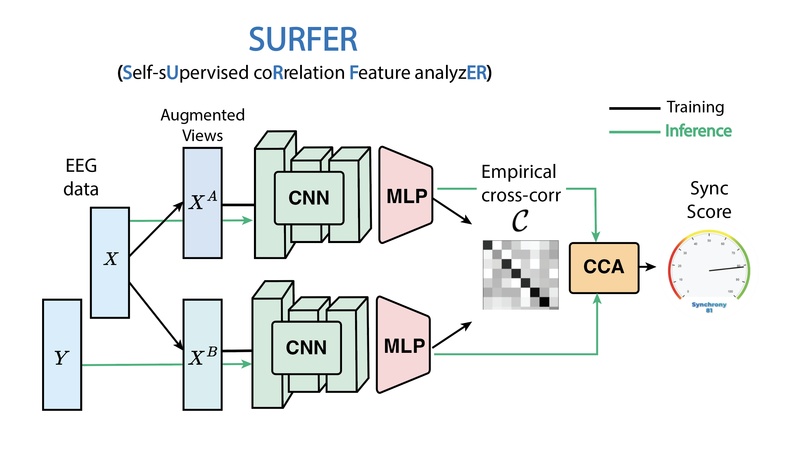

  

   

For [natHACKS 2024](https://neuralberta.tech/nathacks/), an annual neural technology hackathon run by NeurAlbertaTech.

# WaveLink: Neural Synchrony Detection Platform

## Project Overview
WaveLink helps therapists and patients connect better by measuring brain activity alignment, called neural synchrony, using dual-EEG technology. Our SURFER (**S**elf-s**U**pervised co**R**relation **F**eature analyz**ER**) model processes brainwave data to show simple, clear insights on a dashboard on how synchronized two people's brain states are.

This could potentially help therapists adjust in real time, building stronger emotional bonds, reducing stress, and improving outcomes for issues like depression, anxiety, and PTSD. WaveLink makes the invisible connection between patient and therapist visible, creating a new way to improve mental health treatment.

## SURFER Model

  

   

## Core Components
- Dual EEG signal preprocessing
- SURFER neural feature extraction
- Real-time synchrony quantification
- Web-deved visualization dashboard

## Team 
- Zijing Wu 
- Sean Piatt  
- MegH Mistry
- Hildelith Leyser 
- Ian Goodall-Halliwell 
- Sikanderdeep Singh Kingra

<!-- ## Clinical Applications

### Current Use Cases
- Depression Treatment
- Anxiety Management
- PTSD Therapy
- Therapeutic Alliance Building

### Extended Applications
1. **Autism Spectrum Disorders (ASD)**
   - Social interaction monitoring
   - Communication pattern analysis
   - Intervention effectiveness tracking

2. **Foster Care Settings**
   - Attachment formation monitoring
   - Caregiver-child bonding assessment
   - Relationship development tracking

3. **Couples Therapy**
   - Emotional co-regulation analysis
   - Communication pattern optimization
   - Relationship dynamics assessment

## Future Directions

### Near-term Objectives
1. **Multimodal Biometric Integration**
   - Heart Rate Variability (HRV) monitoring
   - Galvanic skin response tracking
   - Temperature sensor integration

2. **Enhanced Analytics**
   - Pattern prediction algorithms
   - Treatment outcome forecasting
   - Personalized intervention recommendations -->

<!-- ### Strategic Goals
1. **Advanced Sensor Integration**
   - Eye-tracking implementation
   - Facial expression analysis
   - Voice pattern recognition

2. **Therapeutic Gamification**
   - Interactive synchrony games
   - Feedback-driven exercises
   - Progress tracking systems -->

<!-- ### Long-term Aspirations
1. **Comprehensive Platform Development**
   - Mobile application integration
   - Cloud-based analysis platform
   - Real-time intervention suggestions

2. **Research Expansion**
   - Cross-cultural validation studies
   - Longitudinal outcome tracking -->

## References
Kinreich, Sivan et al. “Brain-to-Brain Synchrony during Naturalistic Social Interactions.” Scientific reports vol. 7,1 17060. 6 Dec. 2017, doi:10.1038/s41598-017-17339-5

Sened H, Zilcha-Mano S and Shamay-Tsoory S (2022) Inter-brain plasticity as a biological mechanism of change in psychotherapy: A review and integrative model. Front. Hum. Neurosci. 16:955238. doi: 10.3389/fnhum.2022.955238

Chen, T., Kornblith, S., Norouzi, M., & Hinton, G. (2020, November). A simple framework for contrastive learning of visual representations. In International conference on machine learning (pp. 1597-1607). PMLR.

<!-- 
### Neural Synchrony
1. Goldstein, P., et al. (2018). "Brain-to-brain synchrony during naturalistic social interactions." *Nature Human Behaviour*, 2(7), 442-451.

2. Kinreich, S., et al. (2017). "Brain-to-brain synchrony during naturalistic social interactions." *Scientific Reports*, 7(1), 1-12.

### Therapeutic Applications
3. Koole, S. L., & Tschacher, W. (2016). "Synchrony in psychotherapy: A review and an integrative framework for the therapeutic alliance." *Frontiers in Psychology*, 7, 862.

4. Ramseyer, F., & Tschacher, W. (2011). "Nonverbal synchrony in psychotherapy." *Journal of Consulting and Clinical Psychology*, 79(3), 284.

### Technical Implementation
5. Zhang, D., et al. (2019). "A self-supervised learning framework for EEG-based emotion recognition." *IEEE Transactions on Neural Systems and Rehabilitation Engineering*, 27(8), 1594-1604.

6. Wang, Y., et al. (2020). "Deep learning for real-time EEG analysis: A systematic review." *IEEE Access*, 8, 175112-175130. -->

